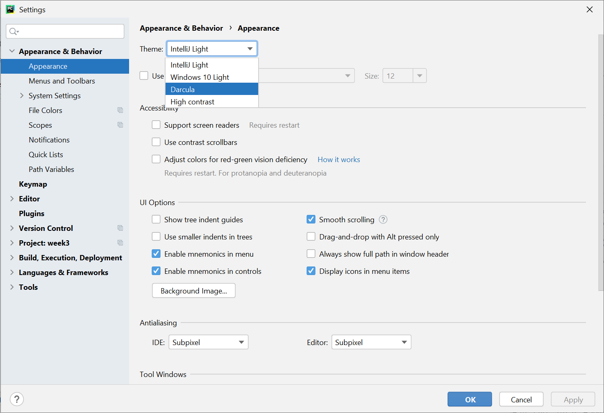
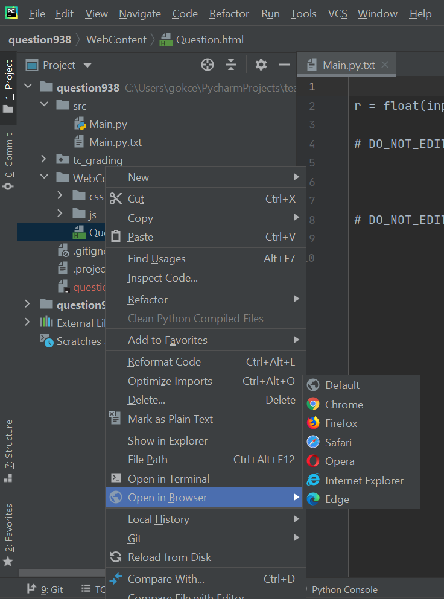
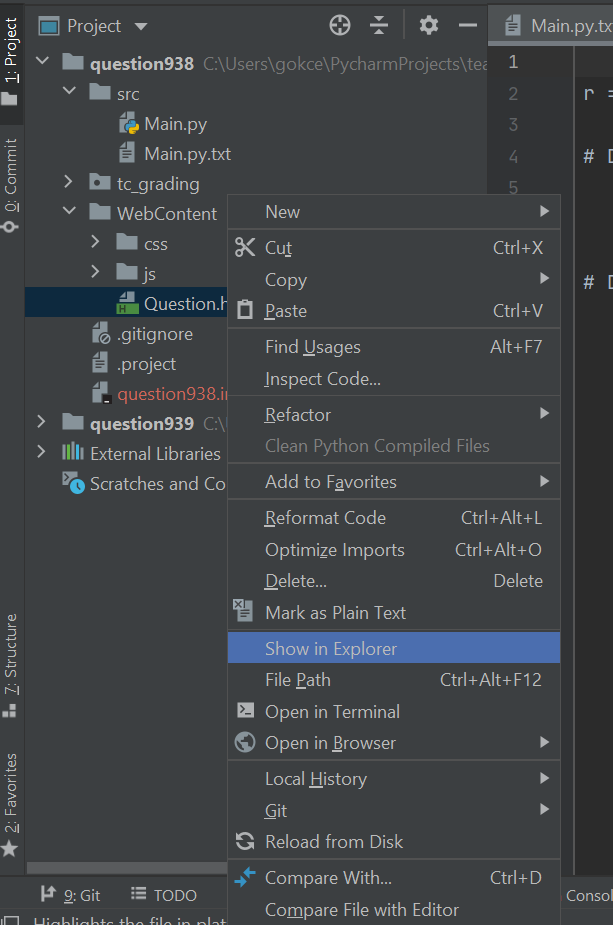
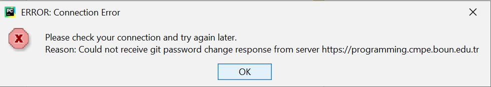

# Table of Contents
1. [Installation Guide](#installation)
2. [Teaching.Codes Quiz Guide](#tc-quiz)
3. [Latest Teaching.Codes Plugin Update (202012121212JB)](#tc-update)
4. [Quiz Reminders](#quiz-reminder)
5. [Quiz Problems](#quiz-problem)
   * [Can't see the button names](#button)
   * [Deleted the contents of Main.py](#mainpy)
   * [Multiple questions](#multiple-question)
   * [Can't see question description](#description)
   * [Can't see the Exam Results](#examresults)
6. [Errors](#error)

## Installation Guide 

* [PDF](Installation%20Guide.pdf)
* Videos
  * Windows: https://www.youtube.com/playlist?list=PLgnOcaYXEY3l_f8c-2bimdtDbXqLo2hsa
  * Linux: https://www.youtube.com/playlist?list=PLgnOcaYXEY3mk8fQp5j3kR8zi7OMpMpJj
  * MacOS: https://www.youtube.com/playlist?list=PLgnOcaYXEY3lbg7Wjs4dB8db8V9vmg1JQ

## Teaching.Codes Quiz Guide 

**Quiz Guide Playlist: https://www.youtube.com/playlist?list=PLgnOcaYXEY3lEkkwZPPFV0FcXtVLhnKdB**

1. Configuring the default Python Interpreter (https://youtu.be/9Ou3WvXMQQU)

   This video explains how to **configure your default Python Interpreter**. You must only do this once, and the default interpreter will be determined for all projects you create, and all Quizzes you take. **If you don't perform this before your Quiz**, your code may be interpreted by a different version of Python in your computer, and **you may not get a full grade**. Please make sure that you set your default Python interpreter as Python 3.8.6 (location may differ in different systems, refer to the *Create a new project* section in the [Installation Guide](Installation%20Guide.pdf). 

2. Teaching.Codes Login (https://youtu.be/AQX5aZXDSz8)

   You must **make sure that you can login** to your Teaching.Codes accounts before the Quiz.

3. Taking the Quiz (https://youtu.be/T1kNINEEPmI)

   This video shows you how a Quiz looks like, and how you submit your solutions. 

4. Problems Encountered during the Quiz (https://youtu.be/1X0weYP8dyQ)

   Please watch the solutions to the **problems encountered during the Quiz**, so that you may take some precautions beforehand. 

   At the end of the video, we show you how to open question description if you can't see it via Teaching Codes. The solution in the video can sometimes give inconsistent results. So here is the updated solution:

   1. Right click on the html file
   2. Choose "**Show in Explorer/Finder**". This step open the folder that contains the html file.
   3. From the folder, open the html file.

You can find all videos inside this playlist (https://www.youtube.com/playlist?list=PLgnOcaYXEY3lEkkwZPPFV0FcXtVLhnKdB). 

5. Open Quiz Grades

   In order to reach your Quiz grades, 

   1. Login to your Teaching.Codes account in PyCharm. 
   2. Select your class (double-click your class under ***Navigator***). 
   3. Check out your grade under ***ExamResults***. 

## Latest Teaching.Codes Plugin Update (202012121212JB) 

To update Teaching.Codes, **you need to uninstall and reinstall the Teaching.Codes plugin**. Please follow these steps: 

1. Download:

   https://programming.cmpe.boun.edu.tr/downloads/StudentPlugin/TCPluginJetBrains_202012121212JB.zip

   If you're using MacOS, please download the .zip file using **Chrome instead of Safari** to avoid any issues.

2. Open PyCharm. 

3. Inside PyCharm, for Windows, click ***File-->Settings***; for MacOS, click ***PyCharm-->Preferences*** and find ***Plugins*** on the left.

4. Go into ***Plugins***, and select the ***Teaching Codes JB*** plugin. From the right, click **the arrow next to the *Disable* button**, and select ***Uninstall***. Select ***Yes*** if it asks for confirmation. 

   

   

5. **When the uninstallation is complete, click OK, and then** **close PyCharm**.

6. **Apply steps 2 and 3**. Go into ***Plugins***, click ***the gear icon*** on the top, and select ***Install Plugin from Disk…*** 

   Navigate to the location of the zip file you've downloaded from the link above (TCPluginJetBrains_202012121212JB.zip) and choose it.

7. After installation is complete, press the ***Restart IDE*** button appeared on the Teaching Codes plugin, or click ***OK***, and then **restart PyCharm** manually. 

   When you restart PyCharm, the Teaching.Codes plugin may not appear on your window. Click ***View-->Tool Windows-->Teaching.Codes***

   When the Teaching.Codes plugin appears in your PyCharm, check your plugin version and make sure that its version matches with the extension of downloaded file (Version: 12.0.0.202012121212JB)

  

## Quiz Reminders 

1. During the Quiz, **do not delete the comments provided in Main.py**. **Write your code between them.**
2. Please, **do not print things like "The result is: ", "Enter an integer:", "Area is: " etc.** You should only print the output listed in the examples. If the output that is expected for the input 2 is 1.0, just print that number. Otherwise, **your extra prints will cause you to get a grade of zero** from that question.

## Quiz Problems 

* If you can't see the button names of your questions 

  * Change the theme by following these steps:

    * Inside PyCharm, for Windows, click ***File-->Settings***; for MacOS, click ***PyCharm-->Preferences*** and find ***Appearance&Behavior*** on the left. 
    * Go into **Appearance** under ***Appearance&Behavior*** 
    * Change Theme from Intellij Light to something else. (**Darcula** seems fine.)
    * Click **OK**

    

* If you have deleted the contents of **Main.py** 

  * Just restore it from **Main.py.txt** under corresponding question's **src** folder

    

* If there are multiple questions 

  * Submit separately
  * Make sure you write the correct Main.py

* If you can't see the Question description 

  * Open the **Question.html** under **WebContent** in a browser

    * Right click on **Question.html** file
    * Click **Open in Browser.** 

      

  * If there are multiple questions and you see the same description for both questions or still blank page. 

    * Right click on **Question.html** file

    * Choose "**Show in Explorer/Finder**". This step open the folder that contains the html file.

      

    * From the folder, open the html file.
    
* If you can't see the Exam Results 

   * Log out, and log in to the Teaching.Codes plugin.
   * Select the class from the Navigator. Wait a while for the class to load. 
   * Click the ExamResults tab. When you click Open under a question, if nothing is happening: 
       * Click the Projects tab on the left of ExamResults
       * Then, go into ExamResults once again. Now, when you click Open, you should be able to see your results. 

## Errors 

* The errors below are usually encountered when consecutive Submit's have been made, or there is a connection issue. 
* If you encounter them, try to Submit once more. 
* If this doesn't work, save your code somewhere else, and try to Logout/Login. 
* If you can't resolve these issues during the Quiz time, please send an e-mail to cmpe150.mail@gmail.com with your solution, and the screenshot of the error __before the Quiz ends.__ If the screenshot also contains the clock on your Desktop showing that the screenshot was taken within the Quiz time,  we will also accept your solution even though your e-mail reached us a few minutes after the Quiz end time. 
* We will manually grade your solutions only if: 
    * You have sent a screenshot of your issue/error
    * You have sent an e-mail of your solutions before the Quiz ends, 
    OR
    * You have sent an e-mail of your solution with a screenshot that contains the clock, showing you've taken the screenshot before the Quiz ends

