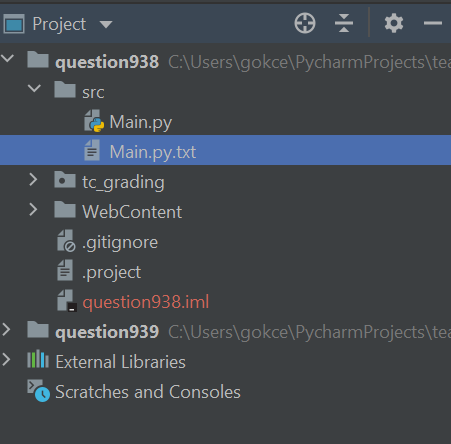

# Frequently Asked Question (FAQ)

1. How can I install the software required for this course?
   * Follow the [Installation Guide](InstallationGuide.md).

2. How can I update Teaching Codes Plugin?
   * Follow the [Teaching Codes Update Guide](TeachingCodesGuide.md)

3. How can I open/submit a project?
   * Follow the [Teaching Codes Guide](TeachingCodesGuide.md)

4. I encountered an error during installation/using Teaching Codes, how can I get help?
   * Check the questions/solutions in this document and then Technical Support Forum on Moodle. If you can't find the solution, send an email to the mail address of your section: cmpe150.mail@gmail.com for CMPE150.01 and cmpe150.mail2@gmail.com for CMPE150.02.

5. I get one of the error listed below while installing Homebrew 

   * curl (6): Could not resolve host: https
   * curl: (1) Protocol ' https not supported or disabled in libcurl

     Try the commands below. If any of them works, then continue installation. When the installation is completed, check it by typing ```brew help```

   * ```bash
     /bin/bash -c "$(curl -fsSL https://raw.githubusercontent.com/Homebrew/install/master/install.sh)"	
     ```

   * ```bash 
     /bin/bash -c "$(curl -fsSL4 https://raw.githubusercontent.com/Homebrew/install/master/install.sh)"
     ```

   * ```bash
     /bin/bash -c "$(usr/bin/curl -fsSL https://raw.githubusercontent.com/Homebrew/install/master/install.sh)"
     ```

   * ```bash
     ruby -e "$(curl -fsSL https://raw.githubusercontent.com/Homebrew/install/master/install)"
     ```
6. I get 'brew not found' error 
   
   * If you are using **zsh**, you need to add HomeBrew to your path in zsh profile:
   
     * Copy and the following line on the terminal, replace \<username\> with your username and then press return (enter).
     
       ```bash 
       echo 'eval $(/opt/homebrew/bin/brew shellenv)' >> /Users/<username>/.zprofile
       ```
     * Then copy and paste the next line on the terminal, press return (enter)

       ```bash 
       eval $(/opt/homebrew/bin/brew shellenv)
       ```
     * Check whether it is succesfully added to the profile, by typing:
     
       ```bash
       brew help
       ```
7. Teaching.Codes Plugin displays 'Nothing to show'
   
   * Make sure you do not extract the Teaching.Codes zip file. 
   * Download the Teaching.Codes zip using Chrome instead of Safari.  
   * If you are using Macbook M1, make sure you install **Intel version of PyCharm.** 
   * Then, reinstall the plugin by following [Teaching.Codes guide](https://github.com/gokceuludogan/CmpE150-Python/blob/main/TeachingCodesGuide.md)  
   *    
8. I can't see the button names in the plugin <a name="button"></a>

   * Change the theme by following these steps:

     * Inside PyCharm, for Windows, click ***File-->Settings***; for MacOS, click ***PyCharm-->Preferences*** and find ***Appearance&Behavior*** on the left. 
     * Go into **Appearance** under ***Appearance&Behavior*** 
     * Change Theme from Intellij Light to something else. (**Darcula** seems fine.)
     * Click **OK**

     

9. I have deleted the contents of **Main.py** <a name="mainpy"></a>
   * Restore it from **Main.py.txt** under corresponding question's **src** folder

     

10. I can't see the Question description <a name="description"></a>
   * Open the **Question.html** under **WebContent** in a browser
   * Right click on **Question.html** file
   * Click **Open in Browser.** 

    

11. If there are multiple questions and you see the same description for both questions or still blank page. 

   * Right click on **Question.html** file
   * Choose "**Show in Explorer/Finder**". This step open the folder that contains the html file.

   

   * From the folder, open the html file.

12. I can't see the Exam Results <a name="examresults"></a>

    * Log out, and log in to the Teaching.Codes plugin.	
    * Select the class from the Navigator. Wait a while for the class to load. 
    * Click the ExamResults tab. When you click Open under a question, if nothing is happening:
      * Click the Projects tab on the left of ExamResults
      * Then, go into ExamResults once again. Now, when you click Open, you should be able to see your results. 

13. What counts as **cheating**:
    * **Information exchange between students:** Giving and Receiving information to/from your colleagues both count as cheating.
    * **Using codes from any source other than the materials of our course:** You can consult internet or books to learn and improve your programming skills. But you shouldn't use any material that is not your own work in the projects and exams.
