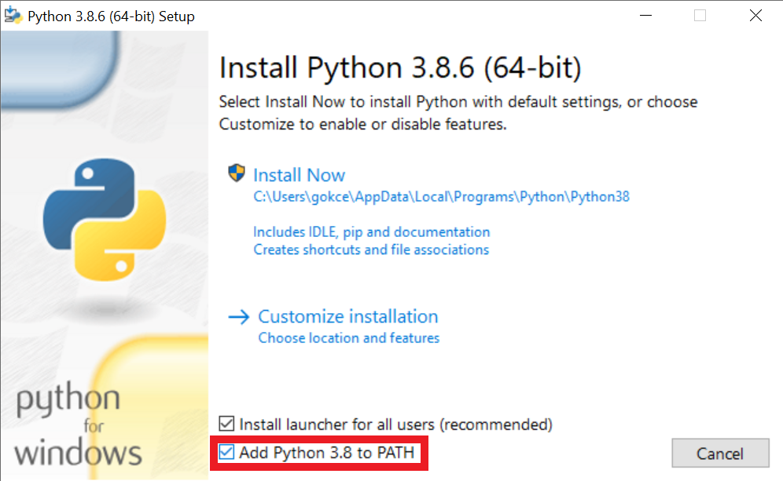
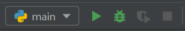
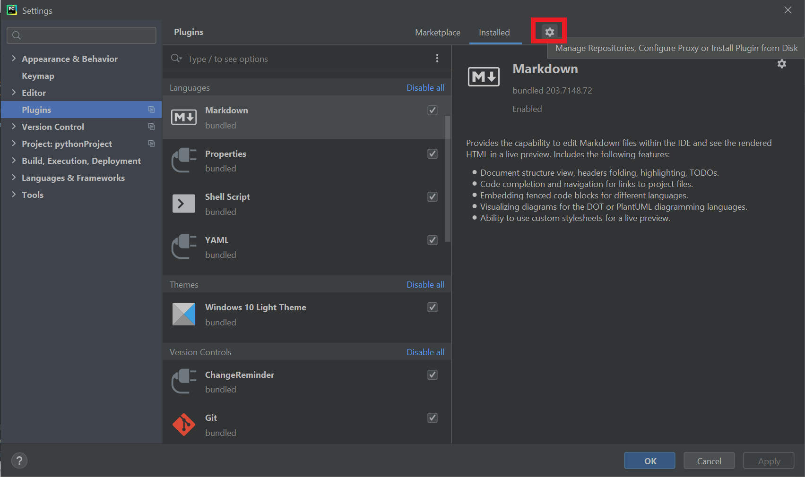
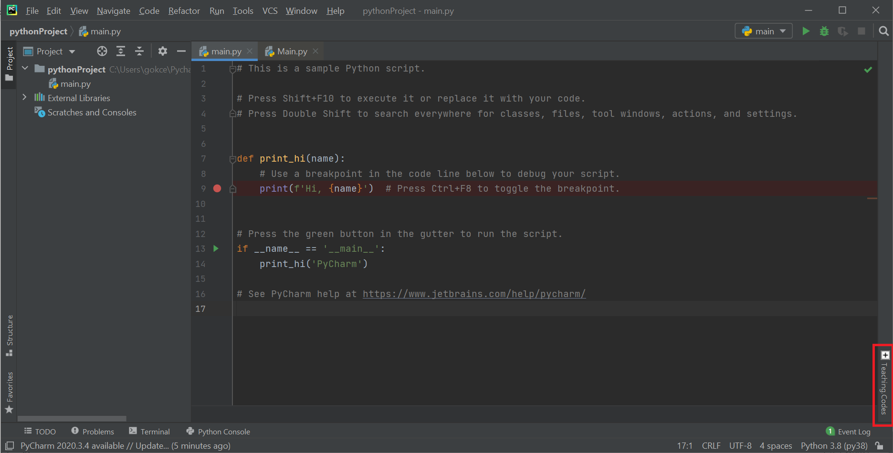

# Table of Contents
1. [Video Tutorials](#videos)
2. [Instructions ](#instructions)
   * Install Python
     * [Windows](#py-win)
     * [Linux (If you don’t have any version of Python installed)](#py-linux-new)
     * [Linux (If you have a different version of Python installed)](#py-linux-old)
     * [MacOS](#py-mac)
   * [Install Pycharm](#pycharm)
   * [Create a New Project](#project)
   * [Install Teaching Codes Plugin](#TC)

# Installation Guide for CMPE 150

This document describes the steps for installing the necessary software for the CMPE 150 Introduction to Computing course. You will need to install the following:

* python3

- PyCharm
- Teaching.Codes plugin

You can find PDF version of this document [here](InstallationGuide.pdf). 

#### Problems

If you encounter a problem during installation, first check **[FAQ](FrequentlyAskedQuestions%20(FAQ).md)** on GitHub and **Technical Support Forum** on Moodle. If you can't find the solution to your problem, describe the problem with the template below and post it to **Technical Support** Forum.

**Operating System:** Specify your operating system: Windows/Linux/MacOS

**Step:** Specify the installation step you got the error: (e.g. Install Python, Step 5)

**Error:** Describe the error. Paste the error or upload a screenshot showing the error.

If the problem still continues, send an email to the mail address of your section: cmpe150.mail@gmail.com for CMPE150.01 and cmpe150.mail2@gmail.com for CMPE150.02.

## Video Tutorials  <a name="videos"></a>

The video tutorials follow the steps described in this document with minor changes. In case of a conflict between the videos and the document, follow the instructions here.

- The installation steps for Windows can be found on [Youtube](https://www.youtube.com/playlist?list=PLgnOcaYXEY3l_f8c-2bimdtDbXqLo2hsa).
- The installation steps for Linux can be found on [Youtube](https://www.youtube.com/playlist?list=PLgnOcaYXEY3mk8fQp5j3kR8zi7OMpMpJj).
- The installation steps for MacOS can be found on [Youtube](https://www.youtube.com/playlist?list=PLgnOcaYXEY3lbg7Wjs4dB8db8V9vmg1JQ).

## Instructions  <a name="instructions"></a>

Step by step instructions for installing these software are provided below for the Windows, MacOS, and Linux operating systems.

### 1. Install Python

#### Windows <a name="py-win"></a>

If Microsoft Store is supported in your computer:

1. Go to Microsoft Store, type python 3.8 in the search bar. Download python 3.8.

2. To control if python3.8 is installed, press the Windows button, then type:	

   ```bash
   cmd
   ```

   and press Return (enter), thus opening the Command Prompt. Type:

   ```bash
   python --version
   ```

   and press Return (enter).

   If you see Python 3.8.x (3.8.6 etc.), python 3.8 has been successfully installed.

If Microsoft Store is not supported in your computer:

1. Go to https://www.python.org/downloads/release/python-386. Navigate to *Files* section. 

2. Download the installer.

   * **Windows x86-64 executable installer** if you're using 64 bit-Windows 
   * **Windows x86 executable installer** if you're using 32 bit-Windows

   To check whether you're using a 32 bit or 64 bit version of Windows: Select the *Start* button, type Computer in the search box, right-click on *Computer*, and then select *Properties* and check *System Type*. 

3. Run the installer

   * Check *Add Python3.8 to PATH*, click *Install Now* and continue default installation. 

     

     

#### Linux (Ubuntu/Debian) - <span style="color:blue">If you don’t have any version of Python installed </span><a name="py-linux-new"></a>

1. As you are going to install Python 3.8 from the source, you need to install some development libraries to compile Python source code. Use the following commands to install prerequisites for Python.

   Open a terminal. Type:

   ```bash
   sudo apt-get install build-essential checkinstall
   ```

   and press Return (enter). Type your password if it asks you to and press Return (enter). Then, type:

   ```bash
   sudo apt-get install libreadline-gplv2-dev libncursesw5-dev libssl-dev libsqlite3-dev tk-dev libgdbm-dev libc6-dev libbz2-dev libffi-dev zlib1g-dev
   ```

   and press Return (enter). If it asks you to confirm the install, type y and press Return (enter).

2. Download Python source code using the following command from python official site. You can also download the latest version in place of specified below. Type:

   ```bash
   cd /opt
   ```

   and press Return (enter). Then, type:

   ```bash
   sudo wget https://www.python.org/ftp/python/3.8.6/Python-3.8.6.tgz
   ```

   and press Return (enter). 

3. Extract the downloaded source archive file by typing:

   ```bash
   sudo tar xzf Python-3.8.6.tgz
   ```

   and pressing Return (enter).

4. Use the below set of commands to compile Python source code on your system using the altinstall command.

   ```bash
   cd Python-3.8.6
   ```

   Press Return(enter).

   ```bash 
   sudo ./configure --enable-optimizations
   ```

   Press Return(enter).

   ```bash
   sudo make altinstall
   ```

   Press Return(enter).

   **Python 3.8.6 has successfully been installed.**

5. To check your Python version, type:

   ```bash
   python -V
   ```

   OR

   ```bash
   python3 -V
   ```

   and press Return(enter). If you see Python-3.8.6, your installation has been successful.

#### Linux (Ubuntu/Debian) - <span style="color:red">If you have a different version of Python than 3.8.6 installed, and actively use it</span> <a name="py-linux-old"></a>

1. Open a terminal.
   First, update your package list by typing:

   ```bash
   sudo apt-get update
   ```

   and press Return (enter). Type your password if it asks you to and press Return (enter). Then, upgrade your packages with:
   
   ```bash
   sudo apt-get upgrade
   ```
   
   and press Return(enter). Type your password if it asks you to and press Return(enter). If it asks you to confirm the install, type y and press Return(enter).
   
2. If you do not have curl and/or git, you need to install them by typing:

   ```bash
   sudo apt install curl
   ```

   Type your password if it asks you to and press Return(enter) to install curl. If it asks you to confirm the install, type y and press Return(enter).
   
   For git type:
   
   ```bash
   sudo apt install git
   ```
   
   Type your password if it asks you to and press Return(enter) to install git. If it asks you to confirm the install, type y and press Return(enter).
   
3. Install some important packages like the build-essential package:

   ```bash
   sudo apt-get install --no-install-recommends make build-essential libssl-dev zlib1g-dev libbz2-dev libreadline-dev libsqlite3-dev wget curl llvm libncurses5-dev xz-utils tk-dev libxml2-dev libxmlsec1-dev libffi-dev liblzma-dev
   ```

   Type your password if it asks you to and press Return(enter). If it asks you to confirm the install, type y and press Return(enter).
   
4. Next, type the following line, then press Return(enter).

   ```bash 
   /bin/bash -c "$(curl -fsSL https://raw.githubusercontent.com/Homebrew/install/master/install.sh)"
   ```

   Type your password if it asks you to and press Return(enter). Then press Return(enter) when it asks you to continue the installation. Wait for the installation to finish. Then type the following line, then press Return(enter).
   
   ```bash
   echo 'eval "$(/home/linuxbrew/.linuxbrew/bin/brew shellenv)"'>> ~/.bashrc
   ```
   
   **Be careful if you are copying from the document, the characters may not exactly be the same (like the single quote) and cause errors.**

   This may complete without issue, (in which case move on to the next step) or give you a permission denied error. If you get this error, **go to your home directory,** press **Ctrl + H** to see the hidden files in your system. Open the **.bashrc** file with a text editor and add a new line at the end of the file, and write the following line there:


   ```bash 
   eval $(/home/linuxbrew/.linuxbrew/bin/brew shellenv)
   ```
   
   **DO NOT CHANGE ANYTHING ELSE ON THE FILE.** Save the file and close it.
   
   Close the terminal. 
   
5. Open a new terminal and type: 

   ```bash 
   brew help
   ```

   and press Return(enter). If everything went well, a bunch of text will appear about how you can use brew. Then, type:

   ```bash
   brew update
   ```

   then press Return(enter).
   After the update finishes, type:

   ```bash
   brew install pyenv
   ```

   then press Return(enter).
   After the installation finishes, type the following line, then press Return(enter).

   ```bash
   echo 'eval "$(pyenv init -)"' >> ~/.bash_profile
   ```

   **Be careful if you are copying from the document, the characters may not exactly be the same (like the single quote) and cause errors.**
   Close the terminal. 

6. Open a new terminal and type:

   ```bash
   pyenv install 3.8.6
   ```

   then press Return(enter).

   This will install Python 3.8.6 to your computer. After the installation finishes, type:

   ```bash
   pyenv global 3.8.6
   ```

   then press Return(enter). This will set python 3.8 as the default python in your computer. Check this by
   typing:

   ```bash
   python -V
   ```

   OR 
   
   ```bash
   python3 -V
   ```
   
   then press Return(enter). If it says python 3.8, installation is complete.

#### MacOS <a name="py-mac"></a>

1. Open your terminal.
   Type the following line, then press Return(enter).

   ```bash
   /bin/bash -c "$(curl -fsSL https://raw.githubusercontent.com/Homebrew/install/master/install.sh)"
   ```

   Type your password if it asks you to and press Return(enter). Then press Return(enter) when it asks you to continue the installation.
   
2. After the installation is complete, check if it is completed successfully by typing

   ```bash 
   brew help
   ```

   in the terminal and pressing Return(enter).

   If it is completed successfully, a bunch of text will appear about how you can use brew. Then, type:

   ```bash
   brew update
   ```

   then press Return(enter). After the update finishes, type:
   
   ```bash
   brew install pyenv
   ```
   
   then press Return(enter). After the installation finishes, type:
   
   ```bash
   echo 'eval "$(pyenv init -)"' >> ~/.bash_profile
   ```
   
   then press Return(enter).

   **Be careful if you are copying from the document, the characters may not be exactly the same (like the single quote) and this may cause errors that you can not notice. We suggest you type the single quotation marks yourselves by using the keyboard.**

   This may complete without issue, (in which case move on to the next step) or give you a permission
denied error. If you get this error, **go to your home directory,** press **Command+Shift+Dot** to see hidden files (You can press them again to hide later.) Open the **.bash_profile** file with a text editor and try to add a new empty line at the end of the file. It may not allow you to, if so, change the permissions of the file to read&write and write to a new line at the bottom of the file the following:
   
   ```bash
   eval "$(pyenv init -)"
   ```
   
   **DO NOT CHANGE ANYTHING ELSE ON THE FILE.** Save the file and close it. Close the terminal.

3. Open a new terminal and type:

   ```bash
   pyenv install 3.8.6
   ```

   then press Return(enter).
   This will install Python 3.8.6 to your computer. After the installation finishes, type:

   ```bash
   pyenv global 3.8.6
   ```

   then press Return(enter). This will set python 3.8.6 as the default python in your computer. Check this by typing:
   
   ```bash
   python -V
   ```
   
   OR 
   
   ```bash
   python3 -V
   ```
   
   then press Return(enter). If it says python 3.8.6, installation is complete.

### 2. Install PyCharm <a name="pycharm"></a>

#### Windows & MacOS

Go to https://www.jetbrains.com/pycharm/

In the Download page, choose your operating system (Windows, Mac or Linux) and download from the “Community” option.

After the download finishes, install PyCharm. Your computer may not trust applications downloaded from the web, if so change this from your system preferences or trust this source in the appearing dialog.

The installation will begin, accept the license agreement and choose your settings like the dark theme, create a launcher script if you wish (you don’t need to), and you will not need any plugins it shows you.

After the installation, run PyCharm.

**Make sure your PyCharm version is 2020.3.X or above. If you have a previous version, you must update it or install new version.**

#### Linux (Ubuntu/Debian)
Go to Ubuntu Software, type *PyCharm Pro*. Install PyCharm Pro.

The installation will begin, accept the license agreement and choose your settings like the dark theme, create a launcher script if you wish (you don’t need to), and you will not need any plugins it shows you.

License Activation window will appear next. Enter your license information that has been sent to you and activate your license.

Welcome to PyCharm window should appear.

**Make sure your PyCharm version is 2020.3.X or above. If you have a previous version, you must update it or install new version.**

### 3. Create a new project <a name="project"></a>

Click on the *New Project* button. From the window that comes up, choose *Pure Python* from the left side.

In the options on the right side, you can write a project name of your choosing at the end of the *Location setting* -the one at the top of the window- by deleting the *pythonProject* and writing something like *myFirstProject* or *hello*.

Then, under *Python Interpreter*, make sure the *New environment using Virtualenv* is checked, and make sure the *Base interpreter* is pointing to **the location of the python you just downloaded**. Windows will usually find this by itself. In Linux and Mac, this may point to the default python which comes pre-installed in your computer; so click the three dots and navigate to your home directory, and find among the hidden files the folder .pyenv and among the files in that directory choose *python3.8.*

The location should be something similar to what is below:

```bash
/home/myusername/.pyenv/versions/3.8.6/bin/python3.8
```

where instead of myusername you will see your own username.

For Linux, if you haven’t installed pyenv during your python installation (if you followed the first set of instructions for your Python installation, which indicates “If you don’t have any version of Python installed” ), you can find the location of your python directory, by typing in the Terminal:

```bash
which python
```

OR 

```python
which python3
```

This will tell you the location of your Python 3.8.6 directory. Your Base Interpreter should point to this location.

Check the *Create a main.py welcome script* for this time and click *Create*. It will take a little while and your project will be created. If you see no errors, everything is in order.



At the top right of your screen, you will see the section in the image above. Click the *Run button* (big green triangle) and at the bottom of the screen a Run window will appear, and it will have the writing:

**Hi, PyCharm**

### 4. Install the Teaching Codes Plugin <a name="TC"></a>

Go to the link for your operating system and download the zip file:

Windows:  https://programming.cmpe.boun.edu.tr/downloads/StudentPlugin/TCPluginJetBrains_Windows.zip

Linux: https://programming.cmpe.boun.edu.tr/downloads/StudentPlugin/TCPluginJetBrains_Linux.zip

MacOS: https://programming.cmpe.boun.edu.tr/downloads/StudentPlugin/TCPluginJetBrains_MacOs.zip

While PyCharm is open, go to *File>Settings* (just *Preferences* in Mac) and find *Plugin*s on the left.

Click the gear icon on the top (shown in red circle in the image below) and click *Install Plugin from*
*Disk…*



Navigate to the location of the zip file and choose it. Click *OK.*

It will ask to restart PyCharm to apply changes in plugins. Click *Restart*.

After it restarts, you should see at the bottom right *Teaching Codes*. Click on it and you should see the
login screen. You can login with the information that has been sent to you.



