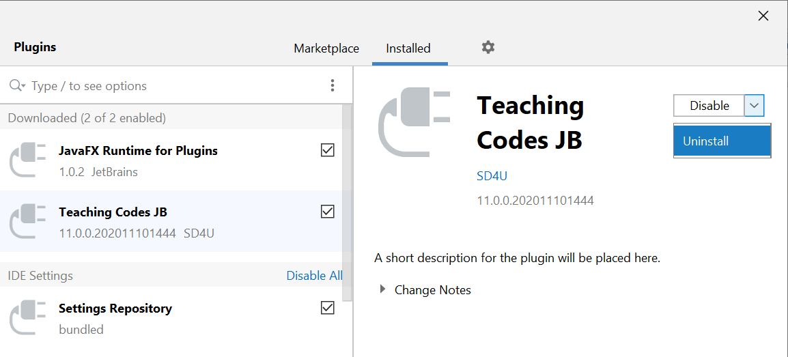

## Teaching.Codes Quiz/Project Guide 

**Quiz Guide Playlist: https://www.youtube.com/playlist?list=PLgnOcaYXEY3lEkkwZPPFV0FcXtVLhnKdB**

1. Configuring the default Python Interpreter (https://youtu.be/9Ou3WvXMQQU)

   This video explains how to **configure your default Python Interpreter**. You must only do this once, and the default interpreter will be determined for all projects you create, and all Quizzes you take. **If you don't perform this before your Quiz**, your code may be interpreted by a different version of Python in your computer, and **you may not get a full grade**. Please make sure that you set your default Python interpreter as Python 3.8.6 (location may differ in different systems, refer to the *Create a new project* section in the [Installation Guide](Installation%20Guide.pdf). 

2. Teaching.Codes Login (https://youtu.be/AQX5aZXDSz8)

   You must **make sure that you can login** to your Teaching.Codes accounts before the Quiz.

3. Taking the Quiz (https://youtu.be/T1kNINEEPmI)

   This video shows you how a Quiz looks like, and how you submit your solutions. 

4. Problems Encountered during the Quiz (https://youtu.be/1X0weYP8dyQ)

   Please watch the solutions to the **problems encountered during the Quiz**, so that you may take some precautions beforehand. 

   At the end of the video, we show you how to open question description if you can't see it via Teaching Codes. The solution in the video can sometimes give inconsistent results. So here is the updated solution:

   1. Right click on the html file
   2. Choose "**Show in Explorer/Finder**". This step open the folder that contains the html file.
   3. From the folder, open the html file.

You can find all videos inside this playlist (https://www.youtube.com/playlist?list=PLgnOcaYXEY3lEkkwZPPFV0FcXtVLhnKdB). 

5. Open Grades

   In order to reach your grades, 

   1. Login to your Teaching.Codes account in PyCharm. 
   2. Select your class (double-click your class under ***Navigator***). 
   3. Check out your grade under ***ExamResults***. 

## Teaching.Codes Plugin Update 

To update Teaching.Codes, **you need to uninstall and reinstall the Teaching.Codes plugin**. Please follow these steps: 

1. Download:

   Windows:  https://programming.cmpe.boun.edu.tr/downloads/StudentPlugin/TCPluginJetBrains_Windows.zip

   Linux: https://programming.cmpe.boun.edu.tr/downloads/StudentPlugin/TCPluginJetBrains_Linux.zip

   MacOS: https://programming.cmpe.boun.edu.tr/downloads/StudentPlugin/TCPluginJetBrains_MacOs.zip

   If you're using MacOS, please download the .zip file using **Chrome instead of Safari** to avoid any issues.

2. Open PyCharm. 

3. Inside PyCharm, for Windows, click ***File-->Settings***; for MacOS, click ***PyCharm-->Preferences*** and find ***Plugins*** on the left.

4. Go into ***Plugins***, and select the ***Teaching Codes JB*** plugin. From the right, click **the arrow next to the *Disable* button**, and select ***Uninstall***. Select ***Yes*** if it asks for confirmation. 

   

5. **When the uninstallation is complete, click OK, and then** **close PyCharm**.

6. **Apply steps 2 and 3**. Go into ***Plugins***, click ***the gear icon*** on the top, and select ***Install Plugin from Disk…*** 

   Navigate to the location of the zip file you've downloaded from the link above (TCPluginJetBrains_XXX.zip) and choose it.

7. After installation is complete, press the ***Restart IDE*** button appeared on the Teaching Codes plugin, or click ***OK***, and then **restart PyCharm** manually. 

   When you restart PyCharm, the Teaching.Codes plugin may not appear on your window. Click ***View-->Tool Windows-->Teaching.Codes***

   