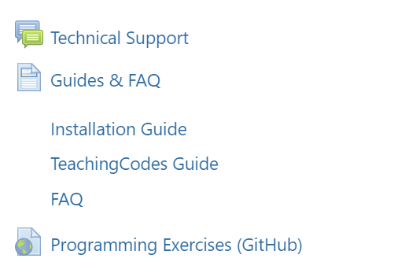

## Welcome to CMPE150 Lab Session and programming!

### Assistants: 

## Announcements

- We will use **PyCharm** and **Teaching Codes** plug-in in projects and exams. Student accounts will be created for this plug-in. 

  - The username and password will be sent to **the e-mail in BUIS** **after add drop period**. We will make an announcement when the credentials are sent.  

  - If your email address that you use in BUIS (registration.boun.edu.tr) is anything other than

    - **@gmail**
    - **@boun.edu.tr**

    Please change it to @gmail.com, or @boun.edu.tr. In order to do that, 
    
    - Go to https://registration.boun.edu.tr, and Login. 
    - Enter General Settings, and then E-Mail Management. 
    - You should change your current Contact E-mail Address to @boun.edu.tr or @gmail.com.  

- Please check announcements on Moodle **regularly**!

- Lab hours are dedicated to **practical programming exercises not for covering lecture materials**. I **strongly** suggest you to attend the lectures. 

- Follow the Installation Guide and TeachingCodes Guide to complete installation and get familiar with the environment.

- The installation must be completed **until April 9, 2021**. After that date, questions regarding installation **WILL NOT BE ANSWERED.**

- Check **FAQ** and **Technical Support** to get help. 

  
