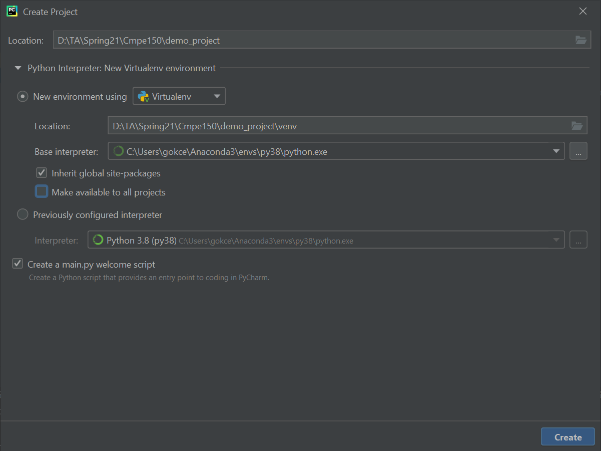
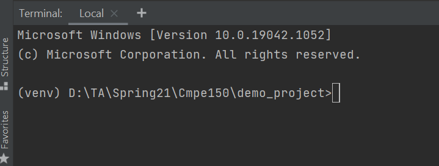
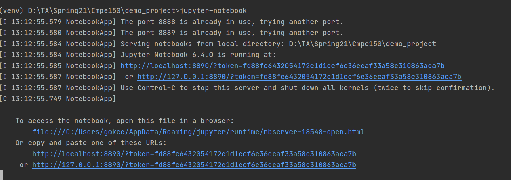

# External Libraries

## Outline

* How to Install External Libraries
* Widely used Python libraries: Numpy and Pandas
* **Demo:** Exploring ‘Game Of Thrones’ Battles

## How to Install External Libraries


* The Python Package Index (PyPI) is a repository of software for the Python programming language.

  **~ 310K packages**

* To install these packages, a package manager is required. PIP is the default package installer for Python. The packages can be downloaded by running the following command on the command line:

  ```bash
  pip install <packagename>
  ```

* However, the projects could have the same dependency, but depend on incompatible versions of the shared package. For example, you can have ProjectA and ProjectB depending on packageX where ProjectA requires the first version of packageX and ProjectB requires the second version of packageX which are not compatible. If you use the same "environment" for both projects, Python cannot differentiate between these versions. Thus, we need separate environments for projects. 

* We can create a new virtual environment while creating a new project in PyCharm:

  

* When we open the terminal after the project is created, we can see that the environment is activated (the name of the virtual environment in brackets).

  

* We need the following libraries for this session: 

  * Numpy (NumericalPython)
  * Pandas (Data Manipulation)
  * Scikit-Learn (Machine Learning)
  * Matplotlib (Visualization)
  * Seaborn (Extension of Matplotlib)
  * Jupyter Notebook (Web based application for documents)

* To install the required packages, open the terminal and run these lines:

  ```bash
  pip install numpy
  ```

  ```bash
  pip install pandas
  ```

  ```bash
  pip install scikit-learn
  ```

  ```bash
  pip install matplotlib
  ```

  ```bash
  pip install seaborn
  ```

  ```bash
  pip install notebook
  ```

* If the installation is completed successfully, you can open Jupyter Notebook by typing `jupyter-notebook` on the command line.

  


## Widely used Python libraries: Numpy and Pandas: available [here](Widely%20used%20Python%20libraries%20Numpy%20and%20Pandas.ipynb) as a jupyter notebook
## Exploring ‘Game Of Thrones’ Battles: available [here](Exploring%20'Game%20of%20Thrones'%20Battles.ipynb) as a jupyter notebook


